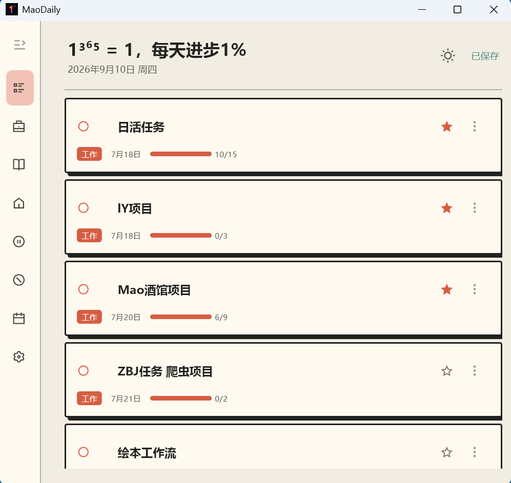
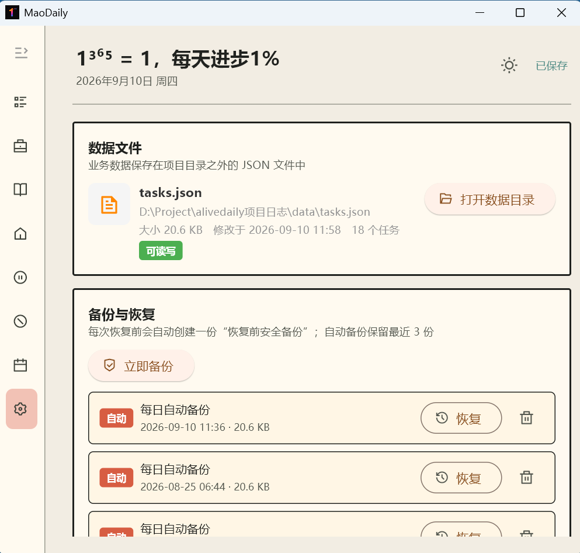

# 🐱 MaoDaily — 桌面每日计划工具

> 一款桌面每日计划管理工具，猫系列品牌家族的一员。
> MaoDaily is a desktop daily planner, a member of the Cat Series brand family.


## ✨ 功能特性 / Features

- **📋 任务管理** — 添加/删除任务，多级步骤（子任务），勾选完成自动归档
- **🏷 分类标签** — 工作 / 学习 / 生活 / 暂时不做 / 就是不做，彩色标签条
- **⭐ 优先级** — 高 / 中 / 低三档，点亮标星
- **📅 月视图日历** — 完整月份网格，任务日期圆点标记，点击筛选当日任务
- **⏰ 提醒系统** — 单次 / 每日 / 每周 / 每月，可设提前提醒，后台轮询 + 系统托盘通知
- **🎨 三套主题** — 亮色 / 暗色 / Neo，一键换肤
- **📦 备份与恢复** — 手动 + 每日自动备份，一键恢复，防意外丢失
- **🗂 可拖拽侧栏** — 拖拽调宽、一键折叠成纯图标模式
- **🖥 纯本地运行** — 数据存本地 JSON，零联网、零隐私泄漏
- **🐈 猫系列基因** — RemixIcon 图标 + Geist 字体 + 中文微软雅黑锁定，细节到位的猫味设计

- **📋 Task Management** — Add/delete tasks with multi-level steps, check off and auto-archive
- **🏷 Categories & Tags** — Work / Study / Life / Not Now / Never, color-coded tag bars
- **⭐ Priority** — High / Medium / Low with star marking
- **📅 Monthly Calendar** — Full month grid, task dots, click a date to filter tasks
- **⏰ Reminders** — One-time / Daily / Weekly / Monthly with advance time, background polling + system tray notification
- **🎨 Three Themes** — Light / Dark / Neo, one-click switch
- **📦 Backup & Restore** — Manual + daily auto backups, one-click restore
- **🗂 Draggable Sidebar** — Drag to resize, one-click collapse to icon-only mode
- **🖥 Fully Local** — Data stays in local JSON, zero network, zero privacy leak
- **🐈 Cat-Series DNA** — RemixIcon icons + Geist font + Microsoft YaHei locked for Chinese, catty details everywhere

## 📸 界面预览 / Screenshots

| 主界面 Main Screen | 设置界面 Settings |
|:---:|:---:|
|  |  |

## 🚀 快速开始 / Quick Start

```bash
# 1. 克隆仓库 / Clone
git clone https://github.com/memory7s/maodaily.git
cd maodaily

# 2. 创建虚拟环境 / Create venv
python -m venv .venv
# Windows:
.venv\Scripts\activate
# macOS / Linux:
source .venv/bin/activate

# 3. 安装依赖 / Install dependencies
pip install -r requirements.txt

# 4. 运行 / Run
python main.py
```

> ⚠️ Windows 下建议先设置 `$env:PYTHONUTF8="1"` 再运行，避免 GBK 控制台 emoji 编码崩溃。

## 🛠 技术栈 / Tech Stack

- Python 3.10+
- Flet 0.86.2（Flutter 渲染引擎）
- 本地 JSON 存储（无数据库，无网络请求）
- RemixIcon v4.6.0（图标字体）
- Geist / Geist Mono（英文标题字体）

## 📦 打包 / Build

```bash
$env:PYTHONUTF8="1"
flet build windows --project maodaily
```

产物在 `build\windows\maodaily.exe`。注意：exe 是启动器，分发需带上整个 `build\windows` 目录结构。

## 🐱 猫系列品牌矩阵 / Cat Series Brand Family

MaoDaily 是「猫系列」的一员。欢迎来逛逛我们的其他项目：

### 🐱 猫工具站 / Cat Toolbox
> 在线工具箱 · 免费 · 无需注册

**https://aitoolmao.com**

50+ 常用在线工具：文本处理、格式转换、编码解码、加密散列、颜色工具、图片处理、视频/音频工具、计算器、开发工具、时间工具、趣味工具、PDF 处理……全部浏览器本地运行，不传数据到服务器。

### 🤖 AI 工具箱 / AI Toolbox
> 800+ AI 工具目录 · 中英双语

**https://aitoolmao.com/ai-tools**

收录全球 800+ 个 AI 工具，覆盖聊天、绘画、视频、音频、编程、办公、教育等全品类，中英双语介绍，帮你快速找到合适的 AI 工具。

### 📰 猫Blog / CatBlog
> 每日 AI & 科技新闻 · 中英双语

**https://aitoolmao.com/blog**

每日自动更新 AI 与科技领域新闻，精选改写自纽约时报中文网、ABC News、AP News 等来源，中英双语发布。关注科技趋势，一杯咖啡的时间看完今日要闻。

### 🐈 MaoDaily（就是本项目）
> 桌面每日计划工具

**https://github.com/memory7s/maodaily**

---

### ☕ 赞助我们 / Support the Cat

如果你觉得「猫系列」项目有帮助，欢迎请我们喝杯咖啡 / 赞助猫粮。你的支持是我们持续更新的动力！

**扫码赞助（微信，金额 1 / 5 / 10 元）：**


**赞助平台：**

| 平台 | 链接 | 状态 |
|------|------|:---:|
| 💚 微信赞赏码 | (上图扫码) | ✅ 可用 |
| ⚡ 爱发电 | https://afdian.com/a/memory7s | ✅ 可用 |
| ☕ Buy Me a Coffee | (待开通) | 🔜 即将上线 |

**爱发电赞助：** 目前设有一档月费方案（¥6/月），也接受一次性打赏。欢迎来主页逛逛 👉 https://afdian.com/a/memory7s

---

## 📄 License / 协议

**PolyForm Noncommercial License 1.0.0**（源码可用许可）

- ✅ 个人使用、学习、研究、fork 修改：完全免费
- ✅ 教育机构、非营利组织、政府机构：免费
- ❌ 商业用途（公司内部部署、打包售卖、做竞品 SaaS）：**需联系作者购买商业授权**

Full text: [LICENSE](LICENSE) / <https://polyformproject.org/licenses/noncommercial/1.0.0>

**The code is source-available, not OSI open source.** Personal / educational / non-profit use is free; commercial use requires a separate license. Contact: [GitHub @memory7s](https://github.com/memory7s)

---